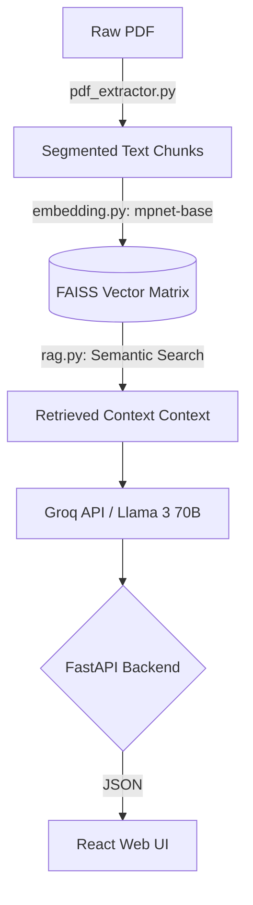

<div align="center">

# 🚀 RAG Analyzer Neural Core

<p align="center">
  
  
  
  
</p>

### A Next-Generation Retrieval Augmented Generation System

*Seamlessly extract knowledge from deep inside annual reports using hyper-fast vector search and state-of-the-art LLMs.*

</div>

---

<br />

## 🌟 The Pipeline Features

<table>
  <tr>
    <td align="center">📄<br/><b>Neural Extractor</b></td>
    <td>High-fidelity PDF parsing and semantic segmentation optimized for financial documents.</td>
  </tr>
  <tr>
    <td align="center">⚡<br/><b>Hyper Retrieval</b></td>
    <td>Ultra-fast topological searches utilizing FAISS in multi-dimensional vector space.</td>
  </tr>
  <tr>
    <td align="center">🧠<br/><b>Synapse LLM</b></td>
    <td>Connected to Groq's high-speed inference engine powered by Meta's Llama 3 70B models.</td>
  </tr>
  <tr>
    <td align="center">🌐<br/><b>Holo-Interface</b></td>
    <td>A totally dark-mode, glassmorphic React Web Application for interactive and immersive analysis.</td>
  </tr>
</table>

<br />

## 🛠️ Initialization Protocols

<details>
<summary><b>🔥 Quick Setup (Click to expand)</b></summary>

### 1. Initialize the Core Envs
Bootstrap your workspace by downloading the dependencies.

```bash
pip install -r requirements.txt
```

### 2. Inject API Keys
Obtain your temporal key from the [Groq Console](https://console.groq.com/).

```bash
# Mac/Linux Environments
export GROQ_API_KEY="gsk_..."

# Windows Environments
set GROQ_API_KEY="gsk_..."
```
</details>

<br />

## 💻 Interfacing

### Option A: The Web Interface (Recommended)
We've built a highly futuristic web application on top of the RAG Core.

1. **Ignite the Backend API:**
```bash
uvicorn api:app --reload
```
2. **Launch the React Frontend:**
Open a new terminal tab and fire up Vite.
```bash
cd frontend
npm install
npm run dev
```
Navigate to `http://localhost:5173` to access the neural link UI!

---

### Option B: The CLI Backbone
If you prefer raw terminal input, utilize the robust CLI system via `main.py`.

<details>
<summary><kbd>Embed Memory</kbd> Extract and chunk your local PDF data.</summary>
<br>

Encode the underlying data matrix:
```bash
python main.py embed --pdf-path "Data/TCS-annual-report-2024-2025.pdf"
```
</details>

<details>
<summary><kbd>Query Node</kbd> Execute one-shot RAG inference.</summary>
<br>

Ask explicit questions:
```bash
python main.py query "What was the revenue growth of the company?" --json
```
</details>

<details>
<summary><kbd>Interactive Loop</kbd> Continuous terminal session.</summary>
<br>

Enter the terminal matrix:
```bash
python main.py interactive
```
</details>

<br />

## ⚙️ Core Configuration

The central nervous system of the RAG pipeline is managed inside `src/config.py`. 

Modify the dataclasses to shift compute paradigms:
```python
from src.config import Config

config = Config()
# Re-route your parsing
config.pdf.pdf_path = "path/to/classified/document.pdf"
# Switch to GPU compute for FAISS
config.embedding.device = "cuda"
# Widen the attention retrieval scope
config.rag.top_k_results = 10 
```

<br />

## 🏗️ Architecture



<br />

## 🛡️ Telemetry & Troubleshooting

- <kbd>ModuleNotFoundError</kbd>: Ensure `requirements.txt` is installed and you are executing from the root directory.
- <kbd>Out of Memory</kbd>: Downscale by altering `config.chunking.sentence_chunk_size` or switching to `device="cpu"` inside the embedding config.
- <kbd>Latency</kbd>: Offload FAISS index matching to GPU memory by installing `faiss-gpu`.

<br />

---
<div align="center">
  <i>Developed dynamically with Advanced Agentic Analysis.</i>
</div>
