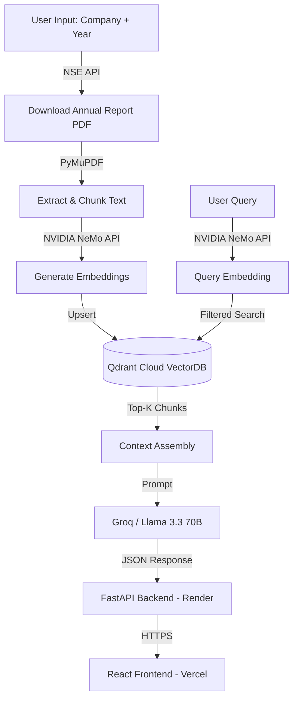

<div align="center">

# 🚀 RAG Annual Report Analyzer

<p align="center">
  
  
  
  
  
  
</p>

### A Production-Ready Retrieval Augmented Generation System

*Seamlessly extract knowledge from deep inside annual reports using vector search and state-of-the-art LLMs — fully deployed and live.*

**🌐 Live App:** [rag-annual-analyzer.vercel.app](https://rag-annual-analyzer.vercel.app/)
&nbsp;|&nbsp;
**⚡ Backend API:** [rag-annual-report-analyzer.onrender.com](https://rag-annual-report-analyzer.onrender.com/docs)

</div>

---

<br />

## 🌟 Key Features

<table>
  <tr>
    <td align="center">📄<br/><b>Auto-Fetch Reports</b></td>
    <td>Automatically searches and downloads annual reports from <b>NSE India</b> given a company name and financial year. No manual PDF uploads needed.</td>
  </tr>
  <tr>
    <td align="center">🧬<br/><b>NVIDIA NeMo Embeddings</b></td>
    <td>Uses NVIDIA's <code>NV-Embed-QA</code> model via the Integrate API for high-quality 1024-dimensional embeddings optimized for retrieval.</td>
  </tr>
  <tr>
    <td align="center">⚡<br/><b>Qdrant Vector Search</b></td>
    <td>Cloud-hosted vector database with filtered search by company and year. Embeddings persist across sessions — no re-indexing needed.</td>
  </tr>
  <tr>
    <td align="center">🧠<br/><b>Groq LLM Inference</b></td>
    <td>Connected to Groq's ultra-fast inference engine running Meta's <b>Llama 3.3 70B</b> for grounded, citation-backed answers.</td>
  </tr>
  <tr>
    <td align="center">🌐<br/><b>Modern React UI</b></td>
    <td>Dark-mode, glassmorphic chat interface with inline page citations, confidence indicators, and source tooltips.</td>
  </tr>
</table>

<br />

## 🏗️ Architecture



<br />

## 🛠️ Tech Stack

| Layer | Technology | Purpose |
|-------|-----------|---------|
| **Frontend** | React + Vite | Chat UI with markdown rendering |
| **Backend** | FastAPI + Uvicorn | REST API with async endpoints |
| **Vector DB** | Qdrant Cloud | Persistent vector storage with filtered search |
| **Embeddings** | NVIDIA NeMo (`NV-Embed-QA`) | 1024-dim passage/query embeddings |
| **LLM** | Groq (Llama 3.3 70B) | Answer generation with citations |
| **PDF Source** | NSE India API | Auto-download annual reports |
| **Hosting** | Vercel (frontend) + Render (backend) | Production deployment |

<br />

## 🚀 Deployment

The application is fully deployed and accessible:

| Service | URL | Platform |
|---------|-----|----------|
| Frontend | [rag-annual-analyzer.vercel.app](https://rag-annual-analyzer.vercel.app/) | Vercel |
| Backend API | [rag-annual-report-analyzer.onrender.com](https://rag-annual-report-analyzer.onrender.com/docs) | Render |
| Vector DB | Qdrant Cloud | Qdrant |

> [!NOTE]
> The Render free tier may spin down after inactivity. The first request after idle could take ~30 seconds to cold-start.

<br />

## 💻 Local Development

<details>
<summary><b>🔥 Quick Setup (Click to expand)</b></summary>

### 1. Clone & Install Dependencies

```bash
git clone https://github.com/ankushsaha96/RAG-annual-analyzer.git
cd RAG-annual-analyzer
pip install -r requirements.txt
```

### 2. Set Environment Variables

Obtain keys from [Groq Console](https://console.groq.com/), [NVIDIA NGC](https://build.nvidia.com/), and [Qdrant Cloud](https://cloud.qdrant.io/).

```bash
# Required API keys
export GROQ_API_KEY="gsk_..."
export NVIDIA_API_KEY="nvapi-..."
export QDRANT_URL="https://your-cluster.qdrant.io:6333"
export QDRANT_API_KEY="your-qdrant-key"
```

### 3. Run the Backend

```bash
uvicorn api:app --reload
```

### 4. Run the Frontend

```bash
cd frontend
npm install
npm run dev
```

Navigate to `http://localhost:5173` to access the UI.

> [!IMPORTANT]
> For local development, update `API_URL` in `frontend/src/App.jsx` to `http://localhost:8000`.

</details>

<br />

## 📡 API Endpoints

| Method | Endpoint | Description |
|--------|----------|-------------|
| `GET` | `/api/status` | Health check |
| `POST` | `/api/check-embeddings` | Check if embeddings exist for a company + year |
| `POST` | `/api/create-embeddings` | Fetch report from NSE, chunk, embed, and store in Qdrant |
| `POST` | `/api/query` | RAG query — retrieves context and generates an LLM answer |

Full interactive docs available at [`/docs`](https://rag-annual-report-analyzer.onrender.com/docs) (Swagger UI).

<br />

## ⚙️ Configuration

The pipeline is configured via dataclasses in `src/config.py`:

```python
from src.config import get_config

config = get_config()
config.qdrant.collection_name    # Qdrant collection
config.qdrant.vector_size        # 1024 (NeMo default)
config.embedding.model_name      # NVIDIA embedding model
config.rag.llm_model             # Groq LLM model
config.rag.top_k_results         # Number of chunks to retrieve
```

<br />

## 🐳 Docker

Build and run the backend locally with Docker:

```bash
docker build -t rag-analyzer .
docker run -p 8000:8000 \
  -e GROQ_API_KEY="gsk_..." \
  -e NVIDIA_API_KEY="nvapi-..." \
  -e QDRANT_URL="https://..." \
  -e QDRANT_API_KEY="..." \
  rag-analyzer
```

<br />

## 🛡️ Troubleshooting

- <kbd>Cold Start Delay</kbd>: Render free tier spins down after inactivity. First request may take ~30s.
- <kbd>NSE Rate Limiting</kbd>: NSE India may block rapid requests. The fetcher uses session warming and proper headers.
- <kbd>Embedding Errors</kbd>: Ensure `NVIDIA_API_KEY` is valid and has quota remaining.
- <kbd>ModuleNotFoundError</kbd>: Run `pip install -r requirements.txt` from the project root.

<br />

---
<div align="center">
  <i>Built with ❤️ using RAG, Vector Search, and Advanced Agentic Coding.</i>
</div>
